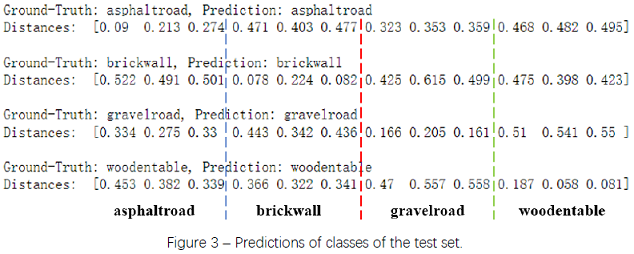
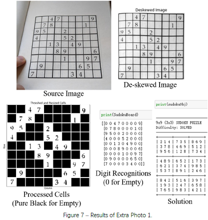

# rennes1-seu-cv

This is my solution to course projects of *rennes1-seu-cv*, the joint program of *Université de Rennes 1*and *Southeast University*.

## [lbp](./lbp)

In this project, we built a texture classifier using Local Binary Pattern (LBP).

## [sudoku](./sudoku)

In this project, we built a Sudoku recognizer via computer vision and solved it. 

